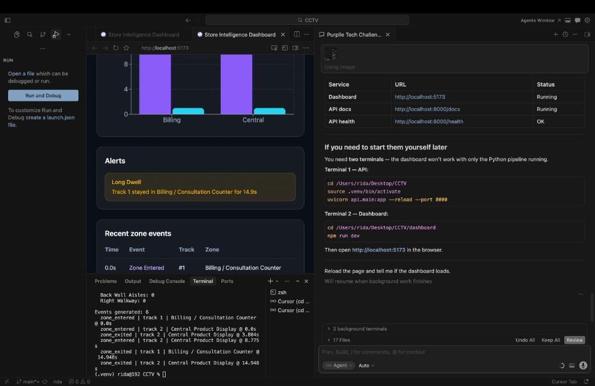

# CCTV Store Analytics

End-to-end **Store Intelligence System** that turns raw CCTV footage into retail analytics — person detection, multi-object tracking, zone-based dwell analysis, a FastAPI backend, and a live React dashboard.

Built as a portfolio project demonstrating computer vision, event-driven architecture, and full-stack AI engineering.

---

## Screenshot



*Live dashboard showing footfall metrics, zone activity charts, anomaly alerts, and recent zone events.*

---

## Demo

| Layer | URL |
|---|---|
| Dashboard | http://localhost:5173 |
| API docs (Swagger) | http://localhost:8000/docs |
| Health check | http://localhost:8000/health |

---

## Features

- **Person detection** — YOLOv8 on CCTV footage (Ultralytics)
- **Multi-object tracking** — ByteTrack for stable person IDs across frames
- **Zone mapping** — Polygon-based store zones (billing, aisles, central display)
- **Event stream** — Structured JSON events (`zone_entered`, `zone_exited`, dwell time)
- **Anomaly detection** — Rule-based alerts (e.g. long dwell at billing counter)
- **REST API** — FastAPI with analytics endpoints
- **Live dashboard** — React + Recharts, auto-refreshes every 5 seconds

---

## Architecture

```text
┌─────────────────────────────────────────────────────────────────┐
│  INPUTS (local — not in repo)                                   │
│  • CCTV videos (CAM 1–5)    • store_layout.xlsx                 │
└───────────────────────────────┬─────────────────────────────────┘
                                ▼
┌─────────────────────────────────────────────────────────────────┐
│  PIPELINE (Python)                                              │
│  detect_demo.py → track_demo.py → zone_events.py                │
│  YOLO detect → ByteTrack → zone polygons → events JSON/CSV      │
└───────────────────────────────┬─────────────────────────────────┘
                                ▼
┌─────────────────────────────────────────────────────────────────┐
│  API (FastAPI)                     │  DASHBOARD (React + Vite)   │
│  /analytics/footfall               │  Footfall cards             │
│  /analytics/zones                  │  Zone charts                │
│  /events                           │  Alerts & event log         │
│  /anomalies                        │  Visitor journeys           │
└─────────────────────────────────────────────────────────────────┘
```

---

## Tech Stack

| Layer | Technologies |
|---|---|
| Computer Vision | Python, YOLOv8, OpenCV, ByteTrack, Shapely |
| Backend | FastAPI, Pydantic, Uvicorn |
| Frontend | React, TypeScript, Vite, Tailwind CSS, Recharts |
| Data | CSV, JSON (sample pipeline outputs included) |

---

## Project Structure

```text
cctv-store-analytics/
├── api/                    # FastAPI backend
│   ├── main.py             # Routes + WebSocket
│   ├── schemas.py          # Pydantic event models
│   └── store.py            # Analytics logic
├── pipeline/               # CV processing scripts
│   ├── detect_demo.py      # Step 1: person detection
│   ├── track_demo.py       # Step 2: tracking + CSV export
│   ├── zone_events.py      # Step 3: zone mapping + events
│   └── zone_mapper.py      # Point-in-polygon zone lookup
├── config/
│   └── zones_cam1.yaml     # Store zone definitions (CAM 1)
├── dashboard/              # React frontend
├── requirements.txt
└── store_layout.xlsx       # Store floor plan reference
```

---

## Prerequisites

- Python 3.9+
- Node.js 18+
- ~5 GB free disk space (for local video files)
- macOS / Linux (tested on Apple Silicon)

---

## Setup

### 1. Clone the repo

```bash
git clone https://github.com/RhythmGupta1920/cctv-store-analytics.git
cd cctv-store-analytics
```

### 2. Add data locally (not included in repo)

Create the data folder and add your files:

```text
data/
└── CCTV Footage/
    ├── CAM 1.mp4
    ├── CAM 2.mp4
    ├── CAM 3.mp4
    ├── CAM 4.mp4
    └── CAM 5.mp4
```

> Videos are excluded from GitHub due to size (~680 MB). Place them locally after cloning.

Optional: add `sales.csv` (POS data) at project root for future sales correlation work.

### 3. Python environment

```bash
python3 -m venv .venv
source .venv/bin/activate        # Windows: .venv\Scripts\activate
pip install -r requirements.txt
```

### 4. Run the CV pipeline (optional — sample outputs already included)

```bash
python pipeline/detect_demo.py    # Person detection demo
python pipeline/track_demo.py     # Tracking + tracks_cam1.csv
python pipeline/zone_events.py    # Zone events + JSON
```

### 5. Start the API

```bash
source .venv/bin/activate
uvicorn api.main:app --reload --port 8000
```

Open **http://localhost:8000/docs** for interactive API documentation.

### 6. Start the dashboard

In a second terminal:

```bash
cd dashboard
npm install
npm run dev
```

Open **http://localhost:5173**

---

## API Endpoints

| Method | Endpoint | Description |
|---|---|---|
| `GET` | `/health` | Service health + data load status |
| `GET` | `/analytics/summary` | Overall stats (visitors, events, anomalies) |
| `GET` | `/analytics/footfall` | Unique visitor count + track IDs |
| `GET` | `/analytics/zones` | Per-zone occupancy and dwell time |
| `GET` | `/events` | Zone enter/exit events (filterable) |
| `GET` | `/tracks` | Visitor journey summaries |
| `GET` | `/anomalies` | Rule-based alerts |
| `WS` | `/ws/live` | Live analytics stream (2s interval) |
| `POST` | `/reload` | Reload pipeline output files |

**Example event:**

```json
{
  "event_type": "zone_entered",
  "camera_id": "CAM 1",
  "track_id": 2,
  "zone": "central_display",
  "zone_label": "Central Product Display",
  "timestamp_sec": 0.0,
  "frame": 0
}
```

---

## What's included vs excluded

| Included in repo | Excluded (local only) |
|---|---|
| All source code | CCTV video files (`data/`) |
| Sample analytics JSON/CSV | `sales.csv` (customer PII) |
| Zone config + store layout | `.venv/`, `node_modules/` |
| Dashboard + API | Generated `.mp4` outputs |

---

## Pipeline Steps

| Step | Script | Output |
|---|---|---|
| 1 | `detect_demo.py` | Annotated video with bounding boxes |
| 2 | `track_demo.py` | Tracked video + `tracks_cam1.csv` |
| 3 | `zone_events.py` | Zone overlay + `zone_events_cam1.json` |
| 4 | `uvicorn api.main:app` | REST API |
| 5 | `npm run dev` | Live dashboard |

---

## Future Improvements

- [ ] Process all 5 cameras (CAM 2–5)
- [ ] Correlate footfall with POS sales data
- [ ] Deploy API (Render/Railway) + dashboard (Vercel)
- [ ] Docker Compose for one-command startup
- [ ] Upgrade to YOLO11 / GPU inference

---

## Author

**Rhythm Gupta** — [GitHub](https://github.com/RhythmGupta1920)

---

## License

This project is for portfolio and educational purposes.
